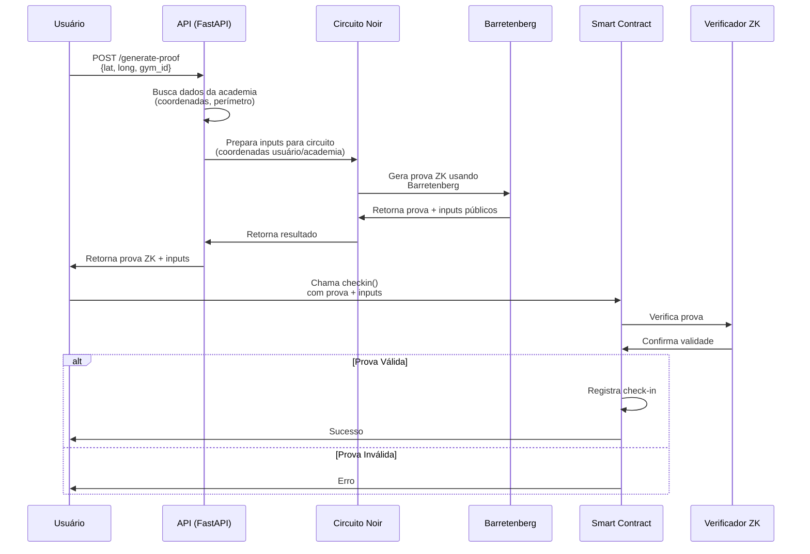

# ZKCheckin

ZKCheckin é um sistema de verificação de presença em academias que utiliza provas de conhecimento zero (Zero Knowledge Proofs) para garantir a privacidade dos usuários enquanto comprova sua presença física no local.

## Como Funciona

1. O usuário envia suas coordenadas GPS
2. O sistema gera uma prova ZK que verifica se o usuário está dentro do perímetro da academia
3. A prova é verificada on-chain, registrando o check-in sem revelar a localização exata do usuário

## Arquitetura e Fluxo

## Componentes

1. **API (FastAPI)**
   - Recebe requisições do usuário
   - Gerencia dados das academias
   - Coordena geração de provas

2. **Circuito Noir**
   - Implementa lógica de verificação
   - Calcula distância entre pontos
   - Gera provas ZK

3. **Smart Contracts**
   - Verifica provas on-chain
   - Registra check-ins
   - Gerencia academias

## Tecnologias

- **Noir**: Linguagem para circuitos ZK e geração de provas
- **Barretenberg**: Backend de prova (off-chain)
- **FastAPI**: API REST para backend
- **Solidity**: Smart Contracts
- **Taraxa**: Blockchain EVM-compatible para registro dos check-ins
- **Docker**: Containerização

## Características

- ✨ Privacidade preservada através de ZK proofs (off-chain)
- 🔒 Verificação on-chain via smart contracts
- 🌍 Suporte a coordenadas GPS
- ⚡ API REST para integração
- 🔗 Compatível com qualquer blockchain EVM
- 🐳 Containerizado para fácil deploy

