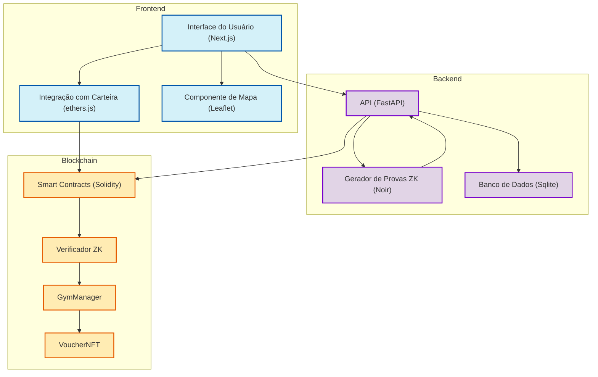
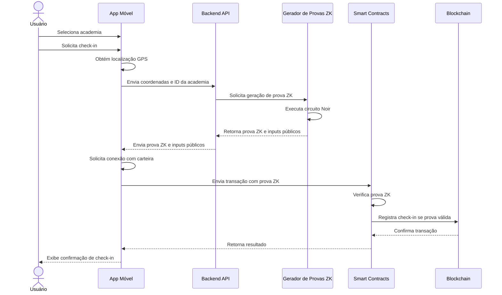
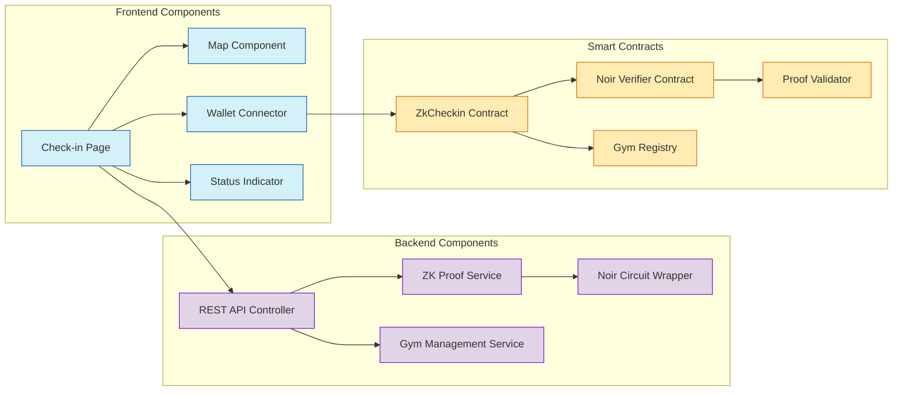
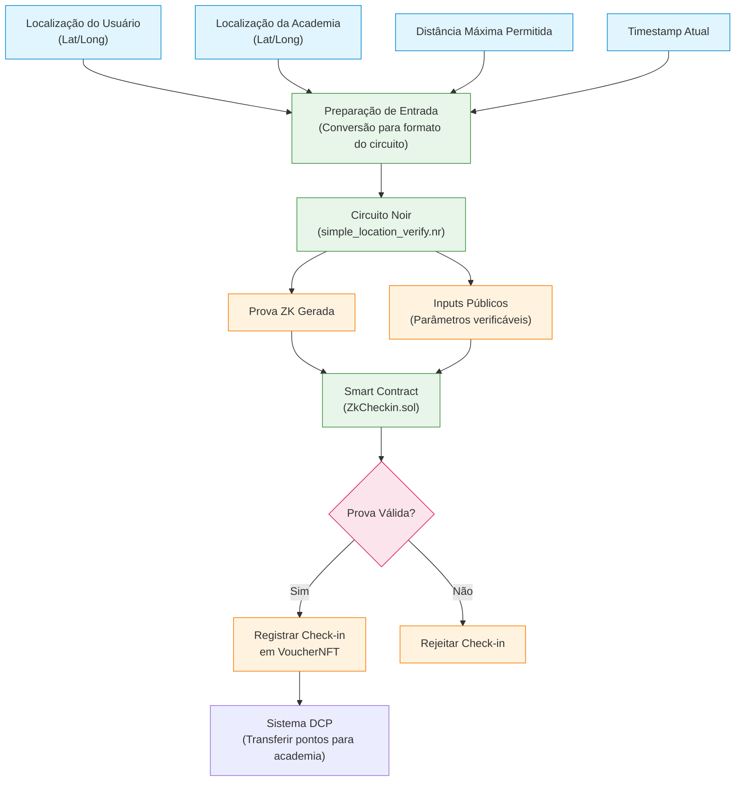
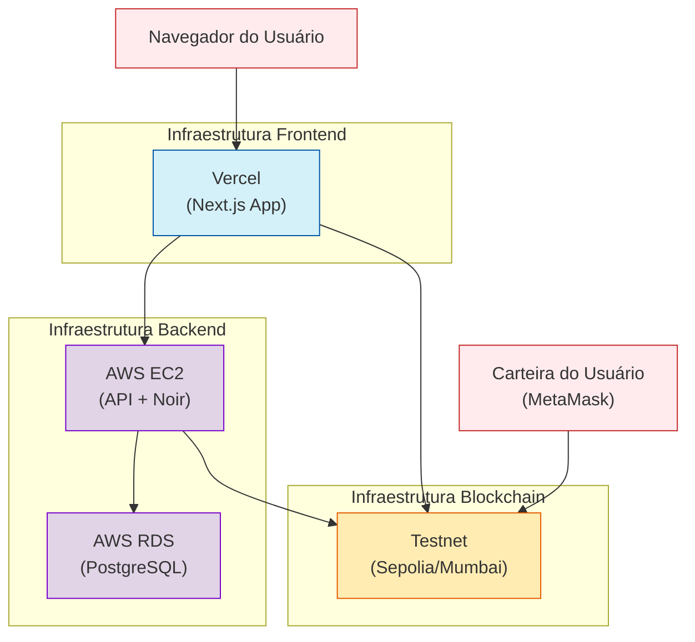
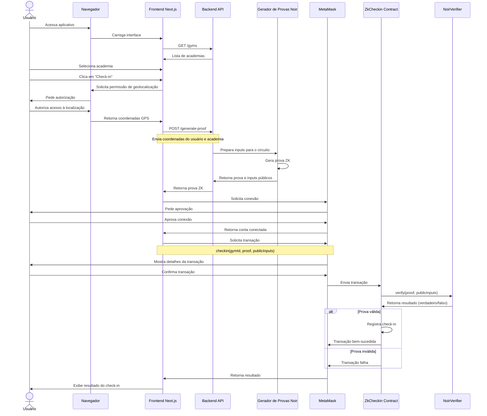
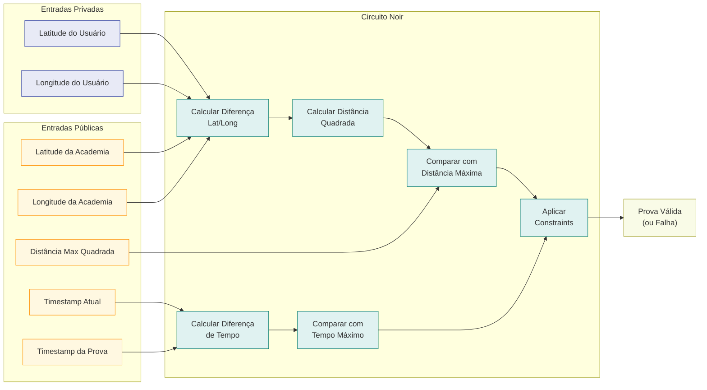
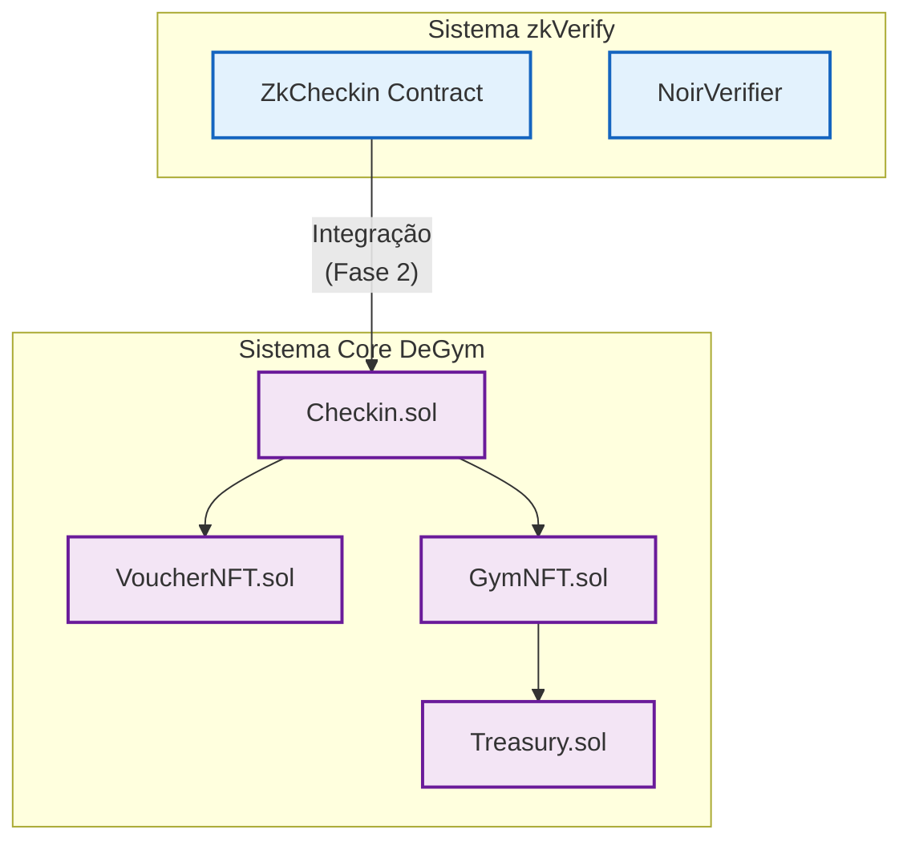

# Diagramas de Arquitetura - zkVerify MVP

Este documento contém os diagramas da arquitetura do MVP do zkVerify, mostrando os fluxos de comunicação entre os diversos componentes do sistema.

## 1. Visão Geral da Arquitetura

## 2. Fluxo de Check-in

## 3. Componentes do Sistema

## 4. Fluxo de Dados Detalhado

## 5. Arquitetura de Implantação

## 6. Fluxo Completo do Check-in com ZK Proofs

## 7. Arquitetura do Circuito Noir

## 8. Integração com os Sistemas Existentes (Fase 2)

## Comunicação entre os Componentes

A arquitetura do MVP do zkVerify foi projetada para permitir a verificação de presença física de usuários nas academias de forma privada e segura, utilizando provas de conhecimento zero. Os fluxos de comunicação são:

1. **App Mobile → Backend API**: Envia dados de geolocalização e solicita geração de prova ZK
2. **Backend → Noir**: Gera provas criptográficas que validam presença sem revelar localização exata
3. **App Mobile → Smart Contract**: Envia a prova gerada para verificação on-chain
4. **Smart Contract → Verificador ZK**: Valida matematicamente a prova
5. **Smart Contract → Sistema Core DeGym**: Registra check-in válido e distribui recompensas

Este design permite uma separação clara de responsabilidades, mantendo a privacidade do usuário em primeiro plano enquanto garante a integridade do sistema de check-in. 